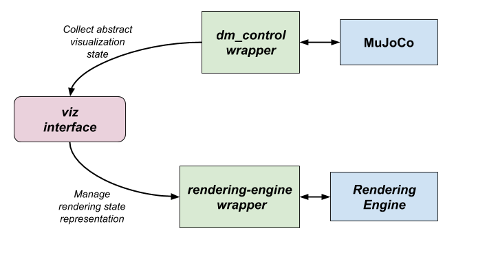
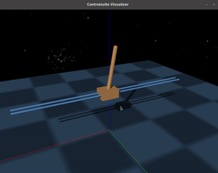
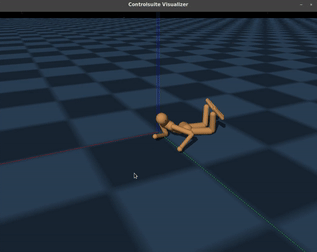
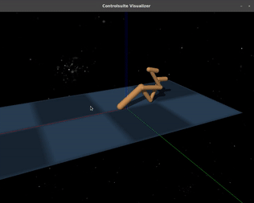

# About the Interactive Visualizer


This is a brief overview of the interactive visualizer I integrated into the main package. The visualizer is built on top of a basic custom engine made with OpenGL and interacts with the main wrapper to achieve the necessary integration.

## **Installation and requirements**

### **Dependencies**

The current implementation depends on the following packages :

* **GLFW**: To create the visualizer window.
* **GLAD**: To load and use the modern OpenGL API.
* **GLM**: To handle matrix and vector operations.
* **PyBind11**: To create the bindings of the rendering engine.

These dependencies are associated to this repo in the form of **submodules**, so in order to get them just clone the repo with the **--recursive** flag :

    git clone --recursive https://github.com/wpumacay/dm_control.git

### **Building and installation**

To build and install the visualizer and its bindings just run :

    python setup.py install

This will build and install the main package and the visualizer into your environment. I recommend to use a virtual env. (e.g. using Anaconda) in order to avoid breaking your current stable _**dm_control**_ package. An example using anaconda would be :

```bash
    # create the environment and install dm_control requirements
    conda create -n dm_control_env python=3.6
    conda install --file requirements.txt
    # change to environment and install everything (along with the visualizer)
    source activate dm_control_env
    python setup.py install
```

## **Usage**

### **Sample code**

```python

from dm_control import suite
from dm_control.glviz import viz
import numpy as np

# Load one task:
env = suite.load( domain_name = "humanoid", task_name = "walk" )
# Create the visualizer
visualizer = viz.Visualizer( env.physics )

# Step through an episode and print out reward, discount and observation.
action_spec = env.action_spec()
time_step = env.reset()

_paused = False

while not time_step.last():
  action = np.random.uniform( action_spec.minimum,
                              action_spec.maximum,
                              size=action_spec.shape )
  if not _paused :
    time_step = env.step( action )

  # Make the visualizer update the scene
  visualizer.update()

  # Some keyboard user checks
  if visualizer.check_single_press( viz.KEY_SPACE ):
    _paused = not _paused
  if visualizer.check_single_press( viz.KEY_ESCAPE ):
    break
```

The visualizer's base API is quite simple. Just import the visualizer with :

```python
from dm_control.glviz import viz
```

This will import the main visualizer interface (which can be found in the [viz.py](https://github.com/wpumacay/dm_control/blob/master/dm_control/glviz/viz.py) file). Then we create the visualizer instance :

```python
visualizer = viz.Visualizer( env.physics )
```

We have to pass as argument the **physics** object that holds the **MuJoCo** data, so that we can use it to collect the necessary information for the wrapper of the rendering engine. Finally, to render the scene we just have to call the update method of the visualizer :

```python
visualizer.update()
```

### **Basic API**

This is some of the functionality that is exposed through the **_viz_** interface.

```python

    """
        Gets the MuJoCo scene wrapped data structure
    """
    def scene(self):
        ...

    """
        Gets the dictionary of meshe-wrapped objects ...
        collected by the visualizer
    """
    def meshes(self):
        ...

    """ 
        Gets the dictionary of geometries' parameters ...
        collected by the visualizer 
    """
    def geometries(self):
        ...

    """ Prints the meshes names from the XML model"""
    def printMeshesNames(self):
        ...

    """ Gets a mesh-wrapped object given the mesh name"""
    def getMeshByName(self, name):
        ...

    """ Checks if key with keycode 'key' is being pressed """
    def is_key_down(self, key):
        ...

    """ Checks if a given mouse button has been pressed """
    def is_mouse_down(self, button):
        ...

    """ Gets the current cursor's position """
    def get_cursor_position(self):
        ...

    """ Checks for a single press of a given key """
    def check_single_press(self, key):
        ...

    """
        Updates the scene by collecting MuJoCo ...
        information and updating the meshes properties 
    """
    def update(self):
        ...

    """
        Creates a camera for the visualizer
    """
    def createCamera(self, camera_type, name, position, target_point, 
                     world_up_id=WORLD_UP_Z,
                     fov=45.0,
                     zNear=1.0,
                     zFar=40.0):
        ...

    """
        Changes to an existent camera given its name
    """
    def changeToCameraByName(self, name):
        ...
```

To check the usage, see the [test.py](https://github.com/wpumacay/dm_control/blob/master/tests/test.py) and [testcameras.py](https://github.com/wpumacay/dm_control/blob/master/tests/testcameras.py) samples.

## **Implementation**

The visualizer is basically a separate module that extracts the data from the MuJoCo wrapper, and then creates its own representation of the scene using the rendering engine wrapper. In each update call the visualizer updates its representation by quering the current state of the MuJoCo scene and updating its internal representation (position and orientation of the meshes in the rendering engine scene). The following picture shows this interaction.



### **Visualizer interface**

The python interface to the visualizer is found in the [viz.py](https://github.com/wpumacay/dm_control/blob/master/dm_control/glviz/viz.py) file, and acts as the bridge between the physics engine and the rendering engine. It takes advantage of the **abstract visualization** implementation of MuJoCo, which after an scene update it throws the necessary rendering information into the **MjvScene** data structure.

### **Rendering-engine wrapper**

The wrappers of the rendering engine can be found in the [wrappers](https://github.com/wpumacay/dm_control/tree/master/dm_control/glviz/wrappers) folder. They expose the necessary functionality to be used by the **viz** interface.

### **Rendering engine**

The actual rendering engine is a submodule pointing to [this](https://github.com/wpumacay/cat1/tree/6d3253b36d8d62b7201bbe1fa360644e6aa647ec) repo, which consists of a basic c++ rendering engine built on top of OpenGL.

## **Visualizer in action**

These are some clips from the visualizer in action :








## **TODOs**

Here are some missing features and fixes. Some other might be missing, so just notify me if you find a bug or need an important feature I haven't listed.

*   **Integrate with the full XML MuJoCo description** : There are some features missing here, like actually using the cameras tags. Right now we just have a main camera and the user has to programmatically created additional cameras.

*   **Implement missing primitive geometries** : Ellipsoid and cylinder are missing.

*   **Correct some environments** : Like the ball-in-cup environment, the light setup doest not allow to see the scene properly. So far, the ones that I found need tweaking are the fish (because of no ellipsoid support yet) and the ball-in-cup environments.

*   **Implement missing lighting features** : Currently the only lights are directional lights, and only 1 per scene is supported. I will be porting the pointlights and spotlights.

*   **Fix shadow-lights** : Currently the shadowmap is generated using a fixed virtual position of the directional light. This would be clear if the agent was running in a certain direction, making the shadow of the agent dissapear. I will be fixing this once I set up an appropiate testing case.

*   **Dependencies and installation** : The current way of installing requires to run the setup.py script after cloning the repository with the recursive flag. This might not be the best way, as just using a single pip command should be enough. If necessary I will change the dependencies to be required for installation (glew instead of glad, glfw) and change the glm function calls to a single small matrix library (with only the necessary bits). The pybind11 dependency is required for the bindings generation though, so I'm not sure how to remove that one.

*   **Clean API** : The API provided by the **viz** interface and much of the functionality used/exposed was intended in a certain degree as a proof-of-concept, so it would need revision and a clear definition of what the user might need. So far, I guess this should work fine for most applications, but as I add more features and test scenarios some refactoring might be needed.